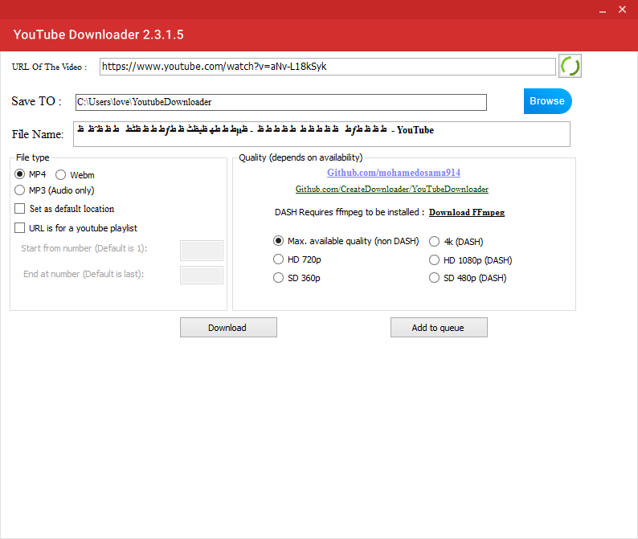
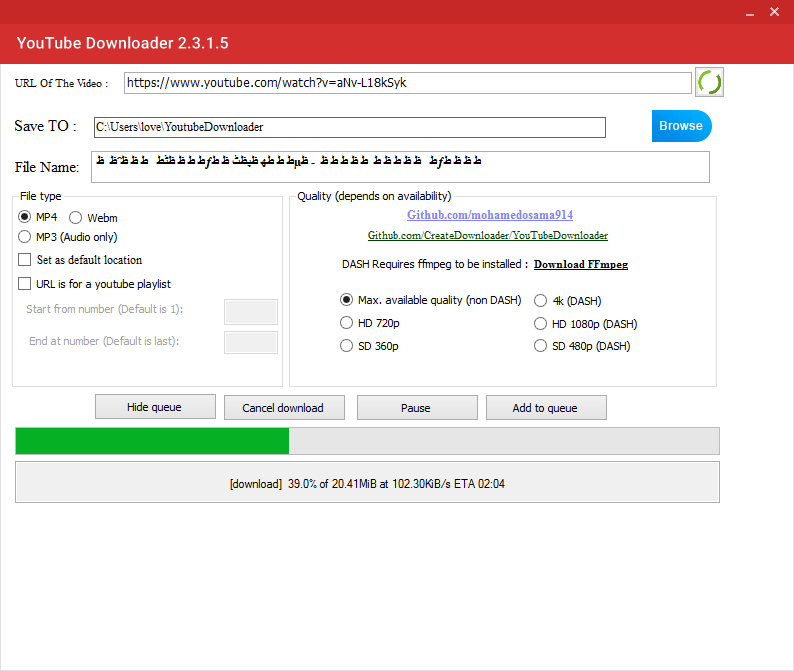

 [](https://github.com/rnand/Youtube-downloader) 
 
 [](https://github.com/CreateDownloader/YouTubeDownloader/)  


# YouTubeDownloader 
A GUI application to download videos from YouTube
*`C# Microsoft Visual Studio (2017 - 2015 - 2013)`*
## ***``Windows OS Desktop PC``*** 
#### ***```To download the executable, go to downloads section under releases```***
 [](https://github.com/CreateDownloader/YouTubeDownloader/releases)
 
***

## The Prerequisites are Required: Loading Preview   
## **`Microsoft .NET Framework 4`**
 [](https://www.microsoft.com/en-in/download/details.aspx?id=17851)

## **`You also need ffmpeg for DASH videos. Get it here Downloader`**
[](http://ffmpeg.org/download.html)

## **`This is a GUI version of youtube-dl found. Get it here Downloader`**
[](https://rg3.github.io/youtube-dl/)
***



This software is the result of my realization that most people (including me) are just too lazy to use the command-line tool ['youtube-dl'](https://rg3.github.io/youtube-dl/). So I decided to build a GUI for it with only the most bare-bone features (youtube-dl has a ton of features which are not available in my version - maybe they will soon be available :p).

You can download videos from other video sharing sites as well. A huge set of sites are supported. To see the full list of supported sites [go here.](https://rg3.github.io/youtube-dl/supportedsites.html) The advanced options like quality etc. are only applicable to youtube at the moment; soon they will apply to other sites as well.

Here it is in action:



### Building

I have used several packages, such as WindowsApiCodePack, Costura.Fordy etc, which NuGet should take care of automatically when building(See [here](https://docs.nuget.org/Consume/Package-Restore)). So clone the repo, and you're good to go.


###USAGE

1. Copy Youtube/vimeo/dailymotion/any-other-supported-site video url to clipboard

2. Open YouTube Downloader.exe

3. Select the necessary options

4. Click *Download*
